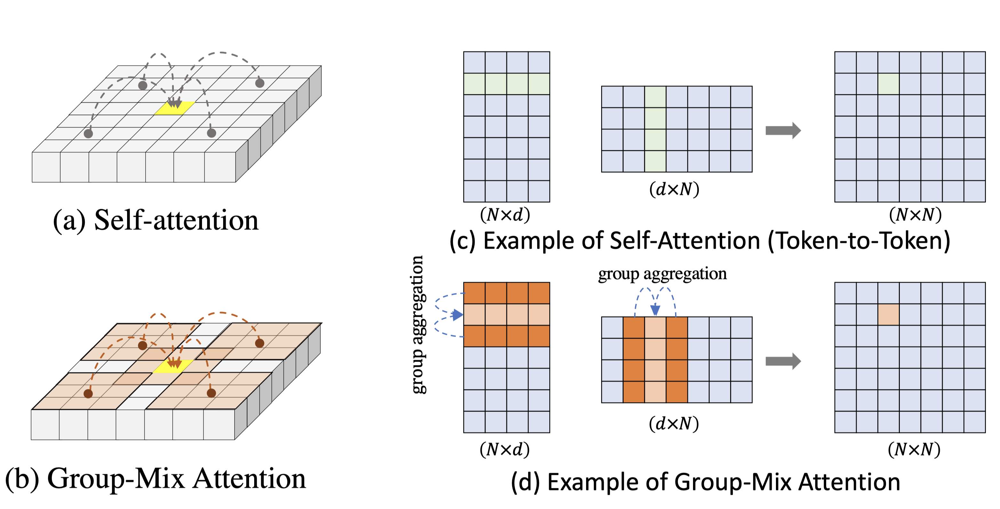

<div align="center">

### **[GroupMixFormer: Advancing Vision Transformers with Group-Mix Attention](xxx)**


[Chongjian Ge](https://chongjiange.github.io/),
[Xiaohan Ding](https://dingxiaohan.xyz),
[Zhan Tong](https://scholar.google.com/citations?user=6FsgWBMAAAAJ&hl=zh-CN),
[Li Yuan](https://yuanli2333.github.io),
[Jiangliu Wang](https://laura-wang.github.io),
[Yibing Song](https://ybsong00.github.io),
[Ping Luo](http://luoping.me/)
<br>


</div>

Official PyTorch implementation of **GroupMixFormer** for the [paper](xx):


 


## 🐱 Abstract
<b>TL; DR: </b> 
<p style="text-align: justify;">
We introduce GroupMixFormer, which employs Group-Mix Attention (GMA) as an advanced substitute for conventional self-attention. GMA is designed to concurrently capture correlations between tokens as well as between different groups of tokens, accommodating diverse group sizes.
</p>

<details><summary><b>Full abstract</b></summary>
<p style="text-align: justify;">
Vision Transformers (ViTs) have shown to enhance visual recognition through modeling long-range dependencies with multi-head self-attentions (MHSA), which is typically formulated as Query-Key-Value computation. However, the attention map generated from the Query and Key only captures token-to-token correlations at one single granularity. In this paper, we argue that self-attention should have a more comprehensive mechanism to capture correlations among tokens and groups (i.e., multiple adjacent tokens) for higher representational capacity. Thereby, we propose Group-Mix Attention (GMA) as an advanced replacement for traditional self-attention, which can simultaneously capture token-to-token, token-to-group, and group-to-group correlations with various group sizes. To this end, GMA splits the Query, Key, and Value into segments uniformly and performs different group aggregations to generate group proxies. The attention map is computed based on the mixtures of tokens and group proxies and used to re-combine the tokens and groups in Value. Based on GMA, we introduce a powerful backbone, namely GroupMixFormer, which achieves state-of-the-art performance in image classification, object detection, and semantic segmentation with fewer parameters than existing models. For instance, GroupMixFormer-L (with 70.3M parameters and 384^2 input) attains 86.2% Top-1 accuracy on ImageNet-1K without external data, while GroupMixFormer-B (with 45.8M parameters) attains 51.2% mIoU on ADE20K.
</p>
</details>


## 🚩 **Updates**

### New features

- ✅ Oct. 18, 2023. Release the training code.
- ✅ Oct. 18, 2023. Release the inference code.
- ✅ Oct. 18, 2023. Release the pretrained models for classification.

### Catalog
- [x] ImageNet-1K Training Code  
- [ ] Downstream Transfer (Detection, Segmentation) Code


## ⚙️ Usage
### 1 - Installation

- Create an new conda virtual environment
```
conda create -n groupmixformer python=3.8 -y
conda activate groupmixformer
```

- Install [Pytorch](https://pytorch.org/)>=1.8.0, [torchvision](https://pytorch.org/vision/stable/index.html)>=0.9.0 following official instructions. For example:
```
pip install torch==1.8.0+cu111 torchvision==0.9.0+cu111 -f https://download.pytorch.org/whl/torch_stable.html
```

- Clone this repo and install required packages:
```
git clone https://github.com/AILab-CVC/GroupMixFormer.git
pip install timm==0.4.12 tensorboardX six tensorboard ipdb yacs tqdm fvcore
```

- The results in the paper are produced with `torch==1.8.0+cu111 torchvision==0.9.0+cu111 timm==0.4.12`.

- Other dependicies: [mmdetection](https://github.com/open-mmlab/mmdetection) and [mmsegmentation](https://github.com/open-mmlab/mmsegmentation) are optional for downstream transfer.

### 2 - Data Preparation
Download and extract ImageNet train and val images from http://image-net.org/.
The directory structure is:

```
│path/to/imagenet/
├──train/
│  ├── n01440764
│  │   ├── n01440764_10026.JPEG
│  │   ├── n01440764_10027.JPEG
│  │   ├── ......
│  ├── ......
├──val/
│  ├── n01440764
│  │   ├── ILSVRC2012_val_00000293.JPEG
│  │   ├── ILSVRC2012_val_00002138.JPEG
│  │   ├── ......
│  ├── ......
```

### 3 - Trianing Scripts
To train GroupMixFormer-Small on ImageNet-1k on a single node with 8 gpus for 300 epochs, please run:
```
python3 -m torch.distributed.launch --nproc_per_node 8 --nnodes 1 --use_env train.py \
  --data-path <Your data path> \
  --batch-size 64 \
  --output <Your target output path> \
  --cfg ./configs/groupmixformer_small.yaml \
  --model-type groupmixformer \
  --model-file groupmixformer.py \
  --tag groupmixformer_small
```

or you can simply run the following script:
```
bash launch_scripts/run_train.sh
```

For multi-node training, please refer to the code: [multi_machine_start.py](multi_machine_start.py)

### 4 - Inference Scripts
To eval GroupMixFormer-Small on ImageNet-1k on a single node, please identify the path of pretrained weight and run:
```
CUDA_VISIBLE_DEVICES=1 OMP_NUM_THREADS=1 python3 -m torch.distributed.launch --nproc_per_node 1 --nnodes 1 --use_env test.py \
  --data-path <Your data path> \
  --batch-size 64 \
  --output <Your target output path> \
  --cfg ./configs/groupmixformer_small.yaml \
  --model-type groupmixformer \
  --model-file groupmixformer.py \
  --tag groupmixformer_small
```

or you can simply run the following script:
```
bash launch_scripts/run_eval.sh
```

This should give 
```
* Acc@1 83.400 Acc@5 96.464
```


## ⏬ Model Zoo

We provide GroupMixFormer models pretrained on ImageNet 2012. You can download the corresponding pretrained and move it to `./pretrained` folder.

| name | resolution |acc@1 | #params | FLOPs | model - configs |
|:---:|:---:|:---:|:---:| :---:|:---:|
| GroupMixFormer-M | 224x224 | 79.6 | 5.7M | 1.4G | [model](https://connecthkuhk-my.sharepoint.com/:f:/g/personal/rhettgee_connect_hku_hk/EuH7I7RGUSVHhD46RTECpesBqJVyACRzmBDwBXYWRxcDtg?e=Qvexbk) - [configs](configs/groupmixformer_miny.yaml) |
| GroupMixFormer-T | 224x224 | 82.6 | 11.0M | 3.7G | [model](https://connecthkuhk-my.sharepoint.com/:f:/g/personal/rhettgee_connect_hku_hk/EnRAzY3LalhGmqx91sEIqrUBLoa5ISS9kOw1ujNcOWSrzA?e=vkCUTZ) - [configs](configs/groupmixformer_tiny.yaml) |
| GroupMixFormer-S | 224x224 | 83.4 | 22.4M | 5.2G | [model](https://connecthkuhk-my.sharepoint.com/:f:/g/personal/rhettgee_connect_hku_hk/Em7lUESSPaFPowQotlsUi1sBjA9uVldOUi2mbqdF40Uktw?e=ExCTeU) - [configs](configs/groupmixformer_small.yaml) |
| GroupMixFormer-B | 224x224  | 84.7 | 45.8M | 17.6G | [model](https://connecthkuhk-my.sharepoint.com/:f:/g/personal/rhettgee_connect_hku_hk/Env1DBxPFZpMifAaVhHpKYgB3O4urE34o4b9_g4Jr-JfQQ?e=C6ed1c) - [configs](configs/groupmixformer_base.yaml) |
| GroupMixFormer-L | 224x224 | 85.0 | 70.3M | 36.1G | [model](https://connecthkuhk-my.sharepoint.com/:f:/g/personal/rhettgee_connect_hku_hk/EuH7I7RGUSVHhD46RTECpesBqJVyACRzmBDwBXYWRxcDtg?e=Qvexbk) - [configs](configs/groupmixformer_large.yaml) |


## 🤗 Acknowledgement
This repository is built using the [timm](https://github.com/rwightman/pytorch-image-models) library, [DeiT](https://github.com/facebookresearch/deit) and [Swin](https://github.com/microsoft/Swin-Transformer) repositories.

## 🗜️ License
This project is released under the MIT license. Please see the [LICENSE](LICENSE) file for more information.

## 📖 Citation
If you find this repository helpful, please consider citing:
```
@Article{xxx
}
```